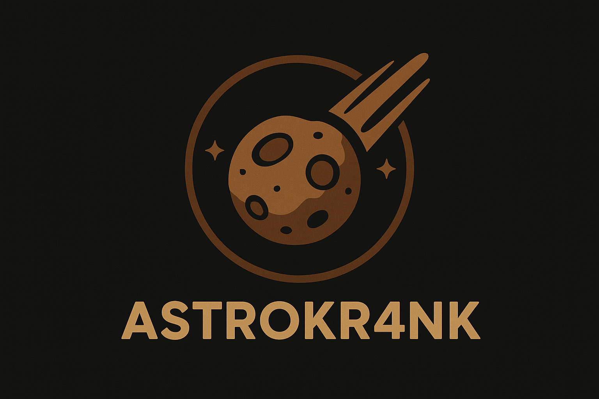

# Introduction
You are a space ship. There are asteroids. Don't get hit by them. Shot asteroids and gain points. When enough points are gained you will gain a level. Your score bar is also your health bar! When it reaches zero, you die. When you gain a level, the score bar will reset.

# Keybinds
* W - Thrust. Moves your spaceship in its forward direction.
* A - Left thrust. Rotates your spaceship to the left.
* D - Right thrust. Rotates your spaceship to the right.
* Space - Laser! Aim at asteroids.

----------
# Install the game

 `uv sync` 

# Start the game
 `uv run main.py` 

----------
# FAQ
## Uv
If you don't have **uv**, you can install it here:

` curl -LsSf https://astral.sh/uv/install.sh | sh`
